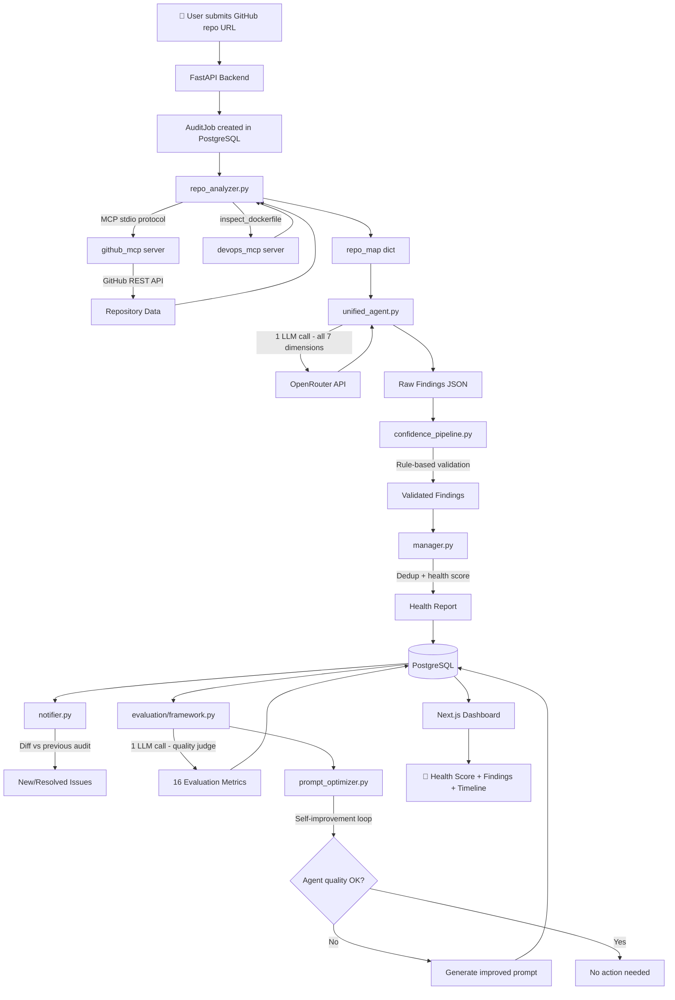
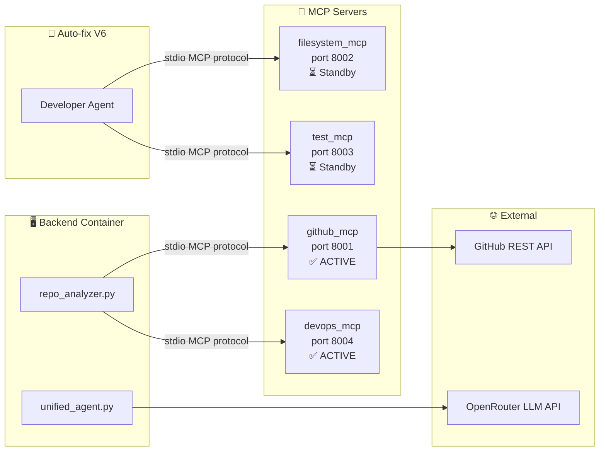

# AgentOps 🤖

> **AI-Powered Autonomous Codebase Auditor & Engineering Assistant**

AgentOps is an LLMOps platform that autonomously investigates a GitHub repository — identifying bugs, security vulnerabilities, performance bottlenecks, architectural problems, testing gaps, DevOps issues, and documentation gaps — explains why they matter, prioritises them by severity and confidence, and calculates an overall health score. Every audit is itself evaluated for quality by a second LLM call and a set of deterministic metrics, feeding a CI/CD quality gate and a self-improvement loop.

**The core value proposition:**
> "You don't need to know what's wrong with your project. AgentOps investigates it for you."

Every finding includes evidence, severity, and a confidence score. Findings below the confidence threshold are never marked auto-fixable. The pipeline itself is continuously evaluated through a CI/CD quality gate.

---

## The Problem It Solves

Solo developers and small teams build projects without a senior engineer looking over their shoulder. They push code with hardcoded secrets, N+1 queries, no tests on critical paths, and Docker containers running as root — not because they don't care, but because they don't know.

AgentOps is that senior engineer. Point it at your repository and it tells you exactly what's wrong, why it matters, and how to fix it.

---

## How It Works



Two LLM calls total per audit: the unified audit call and the evaluation quality-judge call. Health score is computed deterministically from severity counts (see [ARCHITECTURE.md](./docs/ARCHITECTURE.md)) — it is not an LLM output.

## MCP Server Architecture



> `github_mcp` and `devops_mcp` are actively used in the audit pipeline today. `filesystem_mcp` and `test_mcp` are built and running in Docker Compose but are standby — reserved for the auto-fix pipeline once it's wired up.

---

## Live Demo Flow

```
User pastes: https://github.com/username/my-project
```

**Step 1 — Repo Analyzer fetches repo context via github_mcp**
```
Project Type:     Django + React
Languages:        Python, JavaScript
Has Dockerfile:   true
Has CI/CD:        false
Has Tests:        true
Has README:       true
Total Files:      137
```

**Step 2 — One LLM call covers all 7 audit dimensions**

```
POST /api/audits
      │
      ▼
repo_analyzer.py ──► github_mcp (fetches tree + 5 key files)
      │
      ▼
unified_agent.py ──► single LLM call
      (security, code_quality, architecture, performance,
       testing, devops, documentation — all in one prompt)
      │
      ▼
confidence_pipeline.py (rule-based validation, no LLM call)
      │
      ▼
manager.py (dedup + sort + health score — pure Python)
      │
      ▼
Findings + AgentRuns written to PostgreSQL
      │
      ▼
notifier.py diffs against the previous audit for this repo
      │
      ▼
evaluation/framework.py — 4 metric groups + 1 LLM judge call
      │
      ▼
prompt_optimizer.py checks last 5 audits, may trigger self-improvement
```

Two LLM calls total per audit: the unified audit call and the evaluation quality-judge call.

**Step 3 — You receive a Health Report**
```
PROJECT HEALTH SCORE
━━━━━━━━━━━━━━━━━━━━━━━━━━━━━━━

Overall:          71 / 100

🔴 CRITICAL — Fix Immediately
  1. JWT secret hardcoded in users/auth.py (Confidence: 99%)
  2. SQL injection risk in search/views.py (Confidence: 94%)

🟠 HIGH — Fix Soon
  3. N+1 query on every orders request (Confidence: 96%)
  4. Payment processing has 0% test coverage (Confidence: 91%)
  5. Docker container runs as root (Confidence: 98%)

🟡 MEDIUM
  6. No CI/CD pipeline configured
  7. Cyclomatic complexity 18 in checkout.py
  8. API endpoints undocumented
```

Health score is computed deterministically from severity counts (see [ARCHITECTURE.md](./docs/ARCHITECTURE.md)) — it is not an LLM output.

**Step 4 — Auto-fix (endpoint exists, execution not yet wired)**

`POST /api/fixes/{finding_id}/approve` accepts approval for findings with `confidence >= 0.95` and `auto_fix_available = true`, and queues a background task. That background task currently only logs the request — it does not yet write a fix, run tests, or open a PR. See "What's Not Built Yet" below.

---

## Confidence Threshold System

Every finding passes through the confidence pipeline (rule-based checks — evidence exists, detail is substantial, file path is real) before being written to the database.

```
Confidence >= 95%  →  auto_fix_available may remain true
< 95%               →  auto_fix_available forced to false
```

Approving a fix via the API additionally requires `confidence >= 0.95` server-side.

---

## Key Features

| Feature | Description |
|---|---|
| **Single-Call Unified Audit** | One LLM call analyzes all 7 dimensions (security, code quality, architecture, performance, testing, DevOps, documentation) together — 2 LLM calls per audit total |
| **Confidence-Gated Findings** | Rule-based confidence pipeline validates evidence and gates which findings can be auto-fixed |
| **MCP Tool Architecture** | `github_mcp` and `devops_mcp` fetch repository data over the MCP stdio protocol; `filesystem_mcp` and `test_mcp` exist and run but are not yet wired into the pipeline |
| **AI Evaluation Framework** | Deterministic agent/finding/system metrics plus one LLM-as-a-judge call score every completed audit (16 evaluation rows typical) |
| **CI/CD Quality Gate** | `check_threshold.py` reads recent evaluation scores from Postgres and fails the build if quality drops |
| **Self-Improvement Loop** | If `agent_success_rate` over the last 5 audits drops below 0.80, an improved prompt is drafted and benchmarked for the worst-performing agent role |
| **Continuous Monitoring** | GitHub push webhook re-audits the repo and logs new/resolved findings via `notifier.py` |
| **Dashboard** | Next.js app showing audits, findings, evaluation history, and a per-step pipeline timeline |

---

## Tech Stack

| Layer | Technology |
|---|---|
| Frontend | Next.js, TypeScript, Tailwind CSS |
| Backend | FastAPI, PostgreSQL, Redis (standby), SQLAlchemy (async), Alembic |
| LLM | OpenRouter (or any OpenAI-compatible endpoint via `OPENAI_BASE_URL`), model set via `AUTOGEN_MODEL` |
| Agents | Plain async Python — no agent framework; MCP stdio client for `github_mcp` / `devops_mcp` |
| MCP | Python MCP SDK — `github_mcp` / `devops_mcp` active, `filesystem_mcp` / `test_mcp` standby |
| Evaluation | Custom framework — deterministic metrics + a single LLM-as-a-judge call |
| Infrastructure | Docker, Docker Compose, GitHub Actions |
| Deployment | Local Docker only — no cloud deployment yet |

---

## Repository Structure

```
agentops/
├── frontend/                 # Next.js dashboard (src/app, src/components)
├── backend/                  # FastAPI app, DB models, API routes, services
│   ├── api/                  # audits, findings, evaluations, fixes, webhooks
│   ├── models/                # SQLAlchemy models
│   ├── services/               # dispatcher, evaluator, notifier, prompt_optimizer
│   └── tests/                 # API + manager unit tests
├── agents/                   # repo_analyzer, unified_agent, manager, developer,
│                              # individual specialist agents (currently unused),
│                              # prompts/, tools/ (MCP client connectors)
├── mcp_servers/               # github_mcp/devops_mcp (active), filesystem_mcp/test_mcp (standby)
├── evaluation/                 # framework.py, confidence_pipeline.py, metrics/, benchmarks/, tests/
├── infrastructure/            # Dockerfiles for backend, frontend, and each MCP server
├── .github/workflows/          # ci.yml, eval_gate.yml
├── check_threshold.py         # CI quality-gate script
└── docker-compose.yml
```

For a detailed breakdown of every folder, see [ARCHITECTURE.md](./docs/ARCHITECTURE.md).

---

## Documentation Index

| File | What It Covers |
|---|---|
| [ARCHITECTURE.md](./docs/ARCHITECTURE.md) | Folder structure, data flow, MCP server status, DB schema |
| [AGENTS.md](./docs/AGENTS.md) | What each agent module actually does today |
| [EVALUATION.md](./docs/EVALUATION.md) | Confidence pipeline, evaluation framework, quality gate, self-improvement loop |
| [SETUP.md](./docs/SETUP.md) | Local dev setup, environment variables, Docker, running the stack |
| [CONTRIBUTING.md](./docs/CONTRIBUTING.md) | How to add MCP tools, evaluation metrics, and switch between unified/specialist agent modes |
| [ROADMAP.md](./docs/ROADMAP.md) | What's built (V1–V5) and what's planned next |

---

## Try It Yourself

Two repos that demonstrate the contrast:

| Repo | Expected Score | Why |
|---|---|---|
| [encode/httpx](https://github.com/encode/httpx) | 85-95 | Well-maintained, full tests, CI/CD, clean architecture |
| [fportantier/vulpy](https://github.com/fportantier/vulpy) | 40-65 | Intentionally vulnerable, no tests, no CI/CD, hardcoded secrets |

Run both through AgentOps and compare the health scores and findings.

## Sample Audit Results

### vulpy (Intentionally Vulnerable Flask App)

> _Screenshot: dashboard health score ring + critical/high findings list for a `vulpy` audit._

<!--  -->

### httpx (Well-Maintained Reference Project)

> _Screenshot: dashboard health score ring + findings list for an `httpx` audit, shown side by side with vulpy for contrast._

<!--  -->

---

## Quick Start

```bash
# Clone the repository
git clone https://github.com/yourusername/agentops.git
cd agentops

# Copy environment variables
cp .env.example .env
# Fill in POSTGRES_PASSWORD, OPENAI_API_KEY, GITHUB_TOKEN, SECRET_KEY (see SETUP.md)

# Start the full stack
docker compose up --build

# Access the dashboard
open http://localhost:3000
```

Full setup instructions: [SETUP.md](./docs/SETUP.md)

---

## What's Not Built Yet

Being upfront about the gaps:

- **Auto-fix end-to-end** — `POST /api/fixes/{finding_id}/approve` validates and queues a background task, but that task only logs; it does not yet write a fix, run tests via `test_mcp`, or open a PR. This is the next big milestone.
- **`filesystem_mcp` and `test_mcp` in the audit pipeline** — both are built, containerized, and running, but not yet called during an audit (reserved for the auto-fix pipeline).
- **Token/cost tracking** — `AgentRun.tokens_used` and `cost_usd` columns exist but are always `0`; the OpenRouter/OpenAI call sites don't record usage yet.
- **Cloud deployment** — local Docker Compose only.

---

## Why This Project Exists

Built to demonstrate production-grade skills across:

- LLM-powered analysis pipelines and prompt design
- MCP server design and implementation
- AI evaluation, confidence scoring, and LLMOps
- CI/CD pipeline engineering with a real quality gate reading from a live database
- Full-stack development
- Docker-based infrastructure

This project targets roles in **LLMOps**, **AI Engineering**, and **Full-Stack AI** development.
